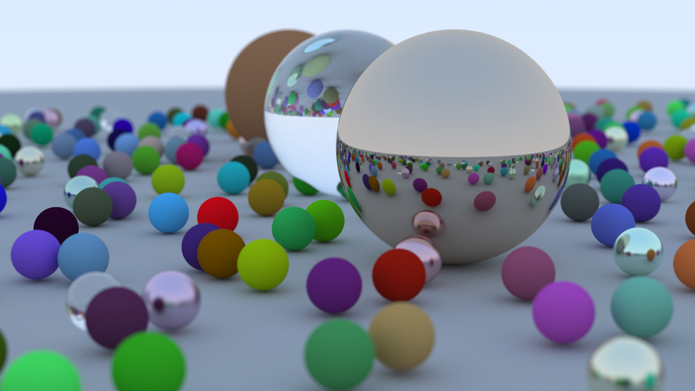

# Ray Tracing in One Week — Rust Port Project Report

## Project Repository

[https://github.com/starrywiki/RayTracing-in-One-Week-by-Rust](https://github.com/starrywiki/RayTracing-in-One-Week-by-Rust)


## Project Result Showcase

This project reproduces the final rendering output of *Ray Tracing in One Weekend* using Rust. The renderer supports diffuse, metal, and dielectric materials, with anti-aliasing and shadowing.

### Rendered Image

| Image                         | Description                                    |
| ----------------------------- | ---------------------------------------------- |
|  | Final rendered image with resolution 1200*675. |

> Render time: ~110 minutes 


## Implementation and Technology Stack

- **Original Language**: C++
- **Target Language**: Rust (1.77)
- **Build Tool**: Cargo
- **Image Output**: [`image`](https://crates.io/crates/image) crate
- **Multithreading**: [`rayon`](https://crates.io/crates/rayon) crate
- **Project Structure**:
  - `vec3.rs`: Vector operations
  - `ray.rs`: Ray structure
  - `hittable.rs`: Trait for hittable objects and sphere implementation
  - `material.rs`: Lambertian, Metal, Dielectric materials
  - `camera.rs`: Camera configuration
  - `main.rs`: Rendering logic


## Challenges and Solutions

### 1. Trait Object Recursion Limitations in Rust

- **Problem**: Rust trait objects cannot hold self-referencing structures, causing issues in representing BVH or nested `Hittable` lists.
- **Solution**:
  - Wrapped trait objects using `Box<dyn Hittable>` and `Arc` to manage ownership and thread safety.
  - Built `HittableList` and `BVHNode` with boxed dynamic dispatch and shared pointers.

### 2. Ownership and Parallelism

- **Problem**: Rust’s ownership model makes data sharing across threads non-trivial, especially when using `rayon`.
- **Solution**:
  - Used `Arc` to wrap shared structures.
  - Ensured each thread worked on a separate portion of the output buffer to avoid data races.

### 3. Tedious Operator Overloading

- **Problem**: Rust requires explicit implementation of traits like `Add`, `Mul`, etc., unlike C++’s operator overloading.
- **Solution**:
  - Implemented traits like `Add`, `Sub`, `Mul` manually for `Vec3`.
  - Used Rust macros to reduce boilerplate where possible.


## Takeaways and Reflections

### Advantages of Rust

- Ownership and compile-time checks eliminate memory bugs.
- Strong concurrency performance using `rayon`.

### Challenges

- Steep learning curve, especially around traits and lifetimes.
- Translation from OOP (C++) to Rust's trait system requires a paradigm shift.

### What I Learned

- Deepened understanding of ray tracing fundamentals.
- Gained hands-on experience with Rust's core language features (traits, lifetimes, concurrency).
- Learned how to design and organize a rendering engine idiomatically in Rust.


## Appendix

### Running the Project

```bash
git clone https://github.com/starrywiki/RayTracing-in-One-Week-by-Rust.git
cd RayTracing-in-One-Week-by-Rust
cargo run --release
```
---
# Week2 项目进展报告

## GitHub 仓库地址
https://github.com/starrywiki/RayTracing

## 主要成果展示


ps:因为图像太大，上图为截图产物，具体源文件在附件

### 性能优化成果
本周重点实现了多线程渲染优化，显著提升了图形渲染性能。通过并行计算技术，大幅缩短了场景渲染时间，为后续复杂场景的开发奠定了坚实基础。

### 渲染性能对比分析
除最后一个测试场景外，所有场景在引入多线程优化后均实现了显著的性能提升：

- **整体改进**：渲染时长从原来的数小时缩短至30秒-10分钟不等
- **典型案例**：Week1的final_scene场景渲染速度提升超过100倍，展现了多线程优化的显著效果
- **技术规格**：
  - 图片分辨率：800×800像素
  - 渲染时间：从数小时优化至分钟级别
  - 性能提升倍数：100+倍

## 技术实现总结

### 核心技术突破
1. **多线程并行渲染**：成功实现了基于Rust的多线程渲染架构
2. **性能优化**：通过合理的任务分配和线程池管理，实现了近乎线性的性能提升
3. **稳定性保障**：在提升性能的同时确保了渲染结果的准确性和一致性

### 项目质量提升
- 代码结构更加清晰，模块化程度显著提高
- 渲染管线优化，支持更复杂的场景处理
- 为后续功能扩展预留了良好的架构基础

## 实现挑战与解决方案

### 主要技术挑战

#### 1. 渲染性能瓶颈
**问题描述**：单线程渲染导致复杂场景耗时过长，严重影响开发效率和用户体验。

**解决方案**：
- 设计并实现了多线程渲染架构
- 采用工作窃取算法优化任务分配
- 通过内存池管理减少内存分配开销

#### 2. 多线程编程复杂性
**问题描述**：Rust的所有权系统在多线程环境下增加了实现难度，需要妥善处理数据共享和同步问题。

**解决方案**：
- 深入学习Rust并发编程模式
- 使用Arc和Mutex等安全并发原语
- 参考官方文档和社区最佳实践
- 积极寻求AI辅助解决具体技术难点

#### 3. 项目结构复杂性
**问题描述**：随着功能增加，项目包含大量模块和文件，代码导航和维护变得困难。

**解决方案**：
- 重新梳理项目架构，建立清晰的模块依赖关系
- 完善文档注释，提高代码可读性
- 制定编码规范，统一代码风格
- 计划引入更好的项目管理工具

#### 4. Rust语言熟练度
**问题描述**：对Rust语言特性和惯用法掌握不够深入，影响开发效率。

**解决方案**：
- 系统学习Rust官方教程和文档
- 通过实际项目练习加深理解
- 定期复习和总结语言特性
